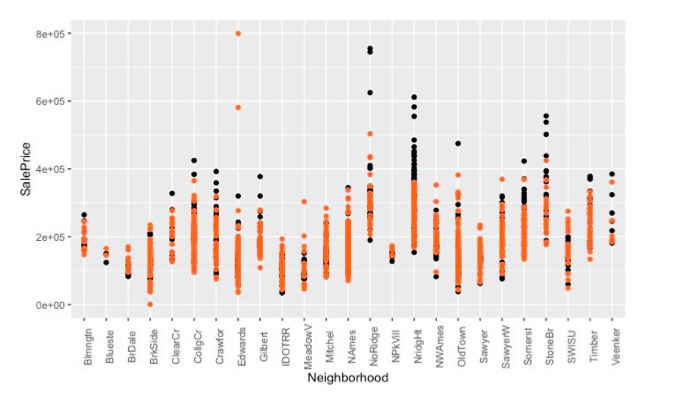

# Ames House Data Analysis
> The project was done as part of the multivariate statistics course exploring data of houses in Ames

## Table of contents
* [General info](#general-info)
* [Screenshots](#screenshots)
* [Code Examples](#code-examples)
* [Status](#status)
* [Contact](#contact)

## General info
The project on house sale price in Ames included several steps and mainly focused on the topics that were covered in multivariate statistics class. 

First of all, we analyzed the data given, to indicate any outliers, to spot any particular correlation, and check assumptions for the linear regression model. Secondly, we plotted the best fit line to look at the significance of each numerical variable related to size, as size factors appear to be dominating in affecting the sale price. Thirdly, we looked at how significant is each categorical feature after adjusting for the size effect. Then, we saw if there was any statistically significant difference across neighborhoods, as it would help us answer our main research question: which neighborhoods are overpriced or underpriced. We also conducted a clustering analysis to see what are the main factors for houses groups. 
In the end, we concluded which particular neighborhoods had higher or lower prices than expected.

**Research Question:** 
Given all background, we wanted to investigate what features of the house affect its sales price and try to spot particular neighborhoods in Ames with underpriced and overpriced houses.

## Screenshots

_Example of over- and underestimation of house prices_

## Code Examples
Looking for outliers in the dataset:

     cooksd <- cooks.distance(mod)
     plot(cooksd, pch="*", cex=2, main="Influential Obs by Cooks distance") + # plot cook's distance 
     abline(h = 4*mean(cooksd, na.rm=T), col="red") + # add cutoff line 
     text(x=1:length(cooksd)+1, y=cooksd, labels=ifelse(cooksd>4*mean(cooksd, na.rm=T),names(cooksd),""), col="red") `

## Status
Project is: _finished_

## Contact
Created by Kelly Huang and Ekaterina Gorbunova - feel free to contact me at eginfo@bu.edu!
